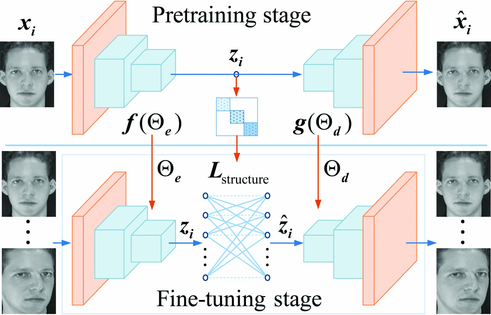

## A Generative Approach to Unsupervised Deep Local Learning
Most existing feature learning methods optimize inflexible handcrafted features and the affinity matrix is constructed by shallow linear embedding methods. Different from these conventional methods, we pretrain a generative neural network by stacking convolutional autoencoders to learn the latent data representation and then construct an affinity graph with them as a prior. Based on the pretrained model and the constructed graph, we add a self-expressive layer to complete the generative model and then fine-tune it with a new loss function, including the reconstruction loss and a deliberately defined locality-preserving loss. The locality-preserving loss designed by the constructed affinity graph serves as prior to preserve the local structure during the fine-tuning stage, which in turn improves the quality of feature representation effectively. Furthermore, the self-expressive layer between the encoder and decoder is based on the assumption that each latent feature is a linear combination of other latent features, so the weighted combination coefficients of the self-expressive layer are used to construct a new refined affinity graph for representing the data structure. We conduct experiments on four datasets to demonstrate the superiority of the representation ability of our proposed model over the state-of-the-art methods.



## Example
```bash
python UDLL_graph_Coil20.py
python UDLL_Coil20.py
```

## Citation
We appreciate it if you cite the following paper:
```
@Article{Zhan8052206,
  author =  {Changlu Chen and Chaoxi Niu and Xia Zhan and Kun Zhan},
  title =   {A Generative Approach to Unsupervised Deep Local Learning},
  journal = {Journal of Electronic Imaging},
  year =    {2019},
  volume =  {28},
  number =  {3},
  pages =   {},

}

```

## Contact
https://kunzhan.github.io

If you have any questions, feel free to contact me. (Email: `ice.echo#gmail.com`)